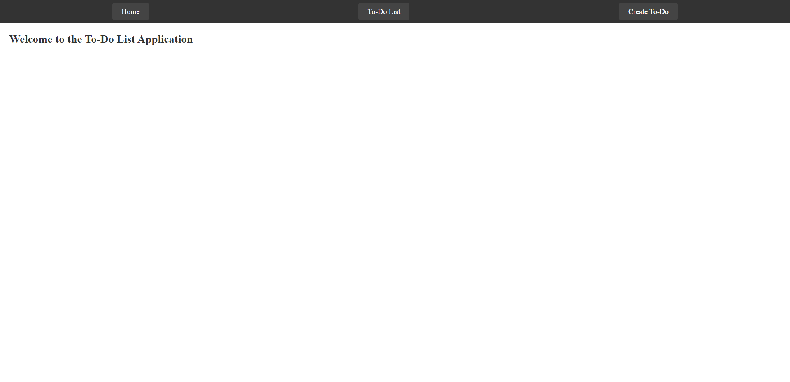
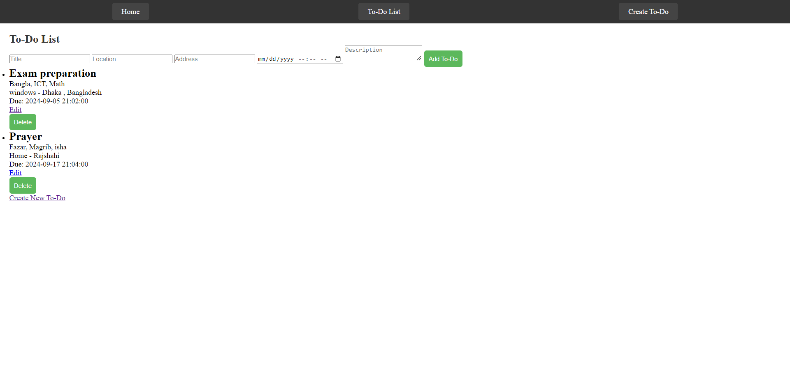
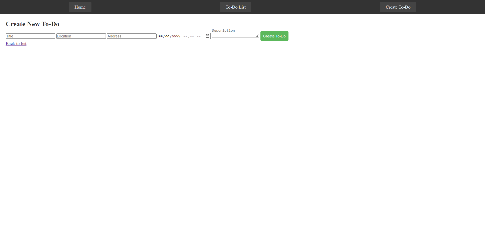

# ToDoModule
 inilab- task 5
# Laravel CRUD Application

This is a simple Laravel CRUD (Create, Read, Update, Delete) application for managing a To-do list. The application has the following stages: Home, To-do List, Create New To-do, and navigating back to the list.

## Features
- View a list of tasks (To-do list)
- Create new tasks
- Edit existing tasks
- Delete tasks
- Mark tasks as completed or pending

## Screenshots

### 1. Home Page

The home page displays an overview of your to-do list with links to perform CRUD operations.



---

### 2. To-do List

The to-do list page displays all created tasks with options to mark them as completed, edit, or delete the tasks.



---

### 3. Create New To-do

On this page, users can create a new to-do by entering task details like title and description. After submitting, the new task is added to the to-do list.



---

### 4. Back to List

Once a new task is created, users can return to the to-do list to view and manage their tasks. The tasks can be marked as completed, edited, or deleted.


---

## Installation

Follow these steps to install and set up the project locally:

1. Clone the repository:
   ```bash
   git clone https://github.com/KabitaYesmin3063/ToDoModule.git
